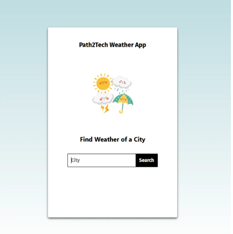
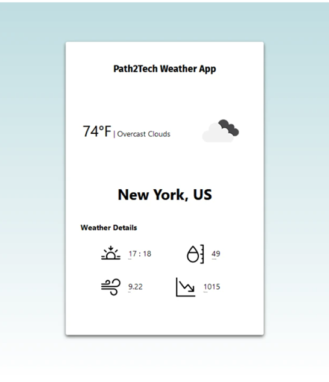

# Weather App — React Project

This project is a responsive weather application built using React. It uses the OpenWeather API to display current weather based on user input and auto-detection.

This application enhances foundational React concepts such as:
- Components and JSX
- Props and event handling
- Form handling
- API calls using `axios` or `fetch`
- React hooks (`useState`, `useEffect`)
- Environment variables for security
- Clean UI/UX best practices

## Live Demo

[View Live App on GitHub Pages](https://NengiIkoli.github.io/Weather-React-Project)

## Features

- Display current weather for a default location on initial load
- Search by city, ZIP code, address, or landmark
- Auto-detect user location (optional)
- Smooth animations and modern UI
- Secure use of API keys through .env files

## Requirements

1. No code should be merged into `main` until all console and terminal errors/warnings are resolved
2. On initial render, app should load weather for a default location
3. App must include a search bar for weather lookups
4. App must accept: city/state, ZIP code, address, or landmark
5. Props should be destructured in child components
6. Use `axios` or `fetch` for API requests
7. API keys must be hidden using a `.env.local` or `.env` file
8. App must use multiple components with data passed via props
9. Follow DRY (Don't Repeat Yourself) principles and clean code practices

## Technologies Used

- React
- JavaScript (ES6+)
- HTML5 and CSS3
- OpenWeather API
- Axios or Fetch
- GitHub Pages for deployment

## Demo/Expected Output:

(Note: Does not have to look exactly like this but still needs to look professional)

>>>>>>> 3b3eaf4 (Update README with screenshots and description)
